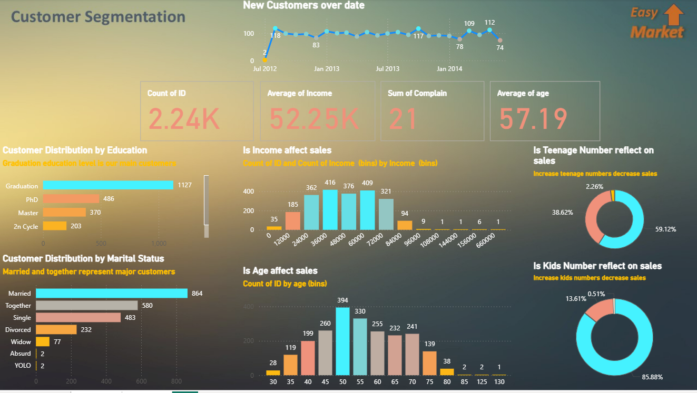

# Customer Segmentation Analysis - Power BI Project

---

## Overview
This project demonstrates a **customer segmentation analysis entirely using Power BI**. The goal is to group customers into distinct segments based on their purchasing behavior and other relevant features using Power BI's data modeling, visualization, and clustering capabilities.

This project is beginner-friendly and shows how **Power BI can be used for data analysis and customer insights** without writing code.

---

## Table of Contents
- [Project Objective](#project-objective)
- [Dataset](#dataset)
- [Methodology](#methodology)
- [Power BI Features Used](#power-bi-features-used)
- [Implementation](#implementation)
- [Results](#results)
- [Conclusion](#conclusion)
- [Future Improvements](#future-improvements)

---

## Project Objective
The main objectives of this project are:
1. Load and explore customer data in Power BI.
2. Identify patterns and segment customers into meaningful groups.
3. Visualize customer segments using Power BI visuals.
4. Provide actionable insights for marketing, sales, or customer relationship management.

---

## Dataset
The dataset used contains basic customer information and their purchasing behavior, such as:
- Customer ID
- Age / Gender (optional)
- Annual Income
- Spending Score / Purchase Frequency
- Other demographic or behavioral features

**Source:** Public datasets like [Mall Customers Dataset on Kaggle](https://www.kaggle.com/datasets/vjchoudhary7/customer-segmentation-tutorial-in-python) can be used and imported directly into Power BI.

---

## Methodology
The project follows these steps:
1. **Data Import:** Load the dataset into Power BI from Excel, CSV, or other sources.
2. **Data Cleaning:** Handle missing values and ensure correct data types.
3. **Data Modeling:** Create relationships if multiple tables are used.
4. **Exploratory Analysis:** Use Power BI visuals (charts, tables, scatter plots) to explore data.
5. **Customer Segmentation:** Apply Power BI's clustering feature to create customer segments.
6. **Visualization:** Use dashboards, slicers, and filters to analyze segments interactively.
7. **Insights:** Interpret customer segments for business decision-making.

---

## Power BI Features Used
- **Data Import & Transform:** Power Query Editor
- **Data Modeling:** Relationships, calculated columns, and measures
- **Visualizations:** Bar charts, pie charts, scatter plots, and tables
- **Clustering:** Power BI built-in clustering for segmenting customers
- **Interactive Dashboards:** Slicers, filters, and drill-through for insights

---

## Implementation
1. Load the dataset into Power BI.
2. Clean and prepare the data using Power Query Editor.
3. Explore data with visuals like:
   - Column charts for spending patterns
   - Scatter plots for income vs. spending
4. Apply **Power BI clustering** to group customers:
   - Select the scatter plot
   - Click on "Cluster" in the analytics pane
   - Choose the number of clusters based on visualization
5. Create a dashboard summarizing customer segments with insights.

---

## Results
- Customers segmented into distinct groups based on income and spending score.
- Each segment is visualized interactively on Power BI dashboards.
- Business insights include identifying high-value and low-value customer groups.

---

## Conclusion
This Power BI project demonstrates **customer segmentation without coding**, showcasing how business users can leverage interactive dashboards and clustering for actionable insights. 

Segmentation helps in:
- Personalizing marketing campaigns
- Optimizing customer engagement
- Identifying high-value customers

---

## Future Improvements
1. Include more customer features (tenure, product categories, online behavior).
2. Combine multiple datasets to enrich analysis.
3. Use Power BI AI features like **Key Influencers** for deeper insights.
4. Publish dashboards to Power BI Service for real-time sharing and collaboration.

---

